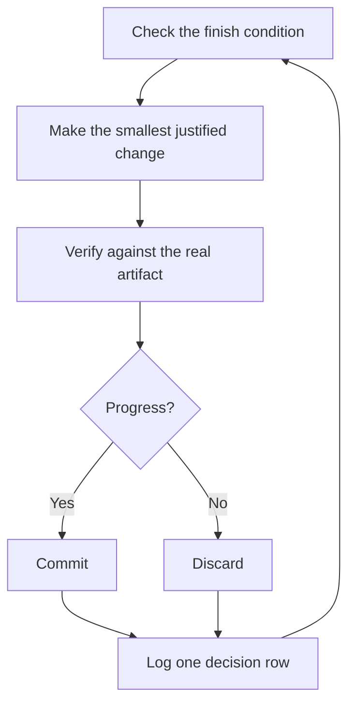

# Run work while you sleep

This is the payoff for everything before it. An agent you can trust to verify its own work is an agent you can leave alone with a hard task. What makes that safe isn't hope. It's a checkable finish condition, an isolated worktree, and a decision log you audit in the morning.


## The overnight contract

A good handoff has the goal, the finish condition, permissions, and an escape hatch. It doesn't need to be long:

```text
$spudex im going to bed. migrate every caller to the new parser in a fresh worktree off <base>.
done means zero old callers, all parser fixtures pass, old api deleted.
keep a decision log. don't ask me before committing.
use a Codex goal and event waits until done. if you're truly stuck after a few hours, stop and write up why.
```

Walk through what each line buys you:

- "im going to bed" requests persistence toward the stated predicate. It does not answer a missing product choice, grant a new permission, or let the agent bypass an approval.
- "done means..." turns the goal into checks every iteration can run.
- "fresh worktree off `<base>`" keeps the run from colliding with anything else you have open.
- "don't ask me before committing" authorizes local commits inside this scoped run. It does not authorize a push, external write, merge, deploy, destructive action, or broader scope.
- the Codex goal keeps the finish condition attached to the active chat. The [Autonomous run playbook](../../playbooks/autonomous-run.md) uses goals, bounded waits, or an explicitly requested automation to re-check it. If a required fresh approval cannot surface, that action stops or fails instead of being guessed through.
- The escape hatch lets it stop at a genuine dead end and write up why, which beats eight hours of creative goal reinterpretation.

Because you'll review this work after stepping away, `$spudex` routes it through [`$spudex figure-it-out`](../../references/capabilities/figure-it-out/SKILL.md), which designs the run's phases before any code and wires in the decision log.

## What the loop does all night



One change, one check, one log row, every iteration. Changes that didn't help get discarded, not left to ride. A plateau means pivot, not stop, and the finish condition never quietly relaxes to declare victory.

## The morning audit

[`$spudex show-me-your-work`](../../references/capabilities/show-me-your-work/SKILL.md) is what makes the run reviewable. Each row records the time, phase, decision, reason, an evidence pointer, and the result, in a TSV at `decisions.tsv` (or `.audit/<task-slug>.tsv` when several runs share a directory). It stays local by default. Commit it when the work is ambitious enough that a reviewer needs the trail to trust the result.

When you're back, ask for the run in review form:

```text
$spudex show-me-your-work catch me up on what you did last night
```

Before the skill hands back its summary, it spawns an independent reviewer to compare the trail with current task evidence, command receipts, artifacts, and git state. The reply ends with an Attention section listing what deserves your scrutiny. Read that section first, then the log rows it points at. You're auditing decisions, not re-reading the whole night.

## When the night holds a queue, not a task

The contract above drives one task to one finish condition. Some nights hold more, a queue of independent changes or a whole program. Three playbooks scale the same trust up.

[Autopilot-full](../../playbooks/autopilot-full.md) runs an authorized queue of independent PRs to merged. Each PR gets one owner agent that carries it through implementation and verification. The root coordinator, not an owner, may merge only after a fresh independent verdict and only when your request already authorized merging:

```text
$spudex full autopilot on this queue. each item is independent. i want them merged by morning.
```

[Autopilot-stack](../../playbooks/autopilot-stack.md) runs the same owner loop but ships nothing. You wake up to one linear stack with a verifier's verdict on every link. It uses Graphite when the repository already uses it and an explicit GitHub base-branch chain otherwise. Pick it over Autopilot-full when the changes are coupled, or when you want your own eyes on the work before anything merges:

```text
$spudex autopilot these five changes but stack them, don't ship. i'll land the stack in the morning.
```

[Orchestrate](../../playbooks/orchestrate.md) is for a program that outlives any single agent: multi-day, many stacked PRs, and waves of subagents under one coordinator. Durable state lives in the run store, branches, PRs, and receipts rather than in any child agent. The coordinator authors briefs, collects finished work, keeps the lowest unmerged PR green, and never writes product code. It's deliberately heavy machinery. If one agent could finish the work in a session, the playbook routes you back to the overnight contract above:

```text
$spudex orchestrate the store migration. own it until every package is converted and merged. i'll check in twice a day.
```

**Pitfall:** a duration is not a finish condition. "work on this for 4 hours" gives the agent nothing to check, and you'll wake up to four hours of motion instead of a result. Give the Codex goal and event-wait mechanism a predicate that can pass or fail.

Next: [Steer with principle names](./08-principles.md).
